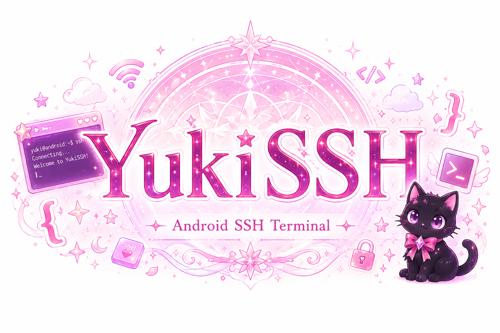
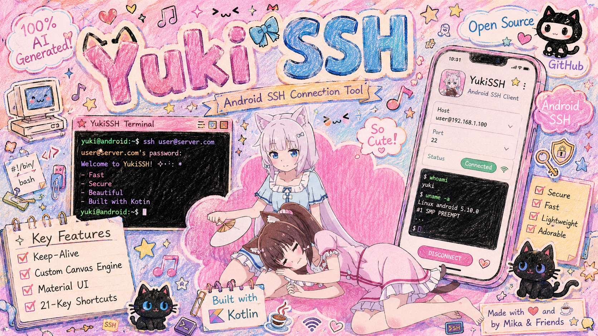
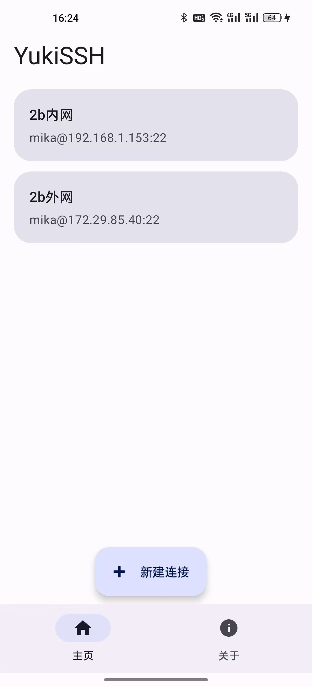
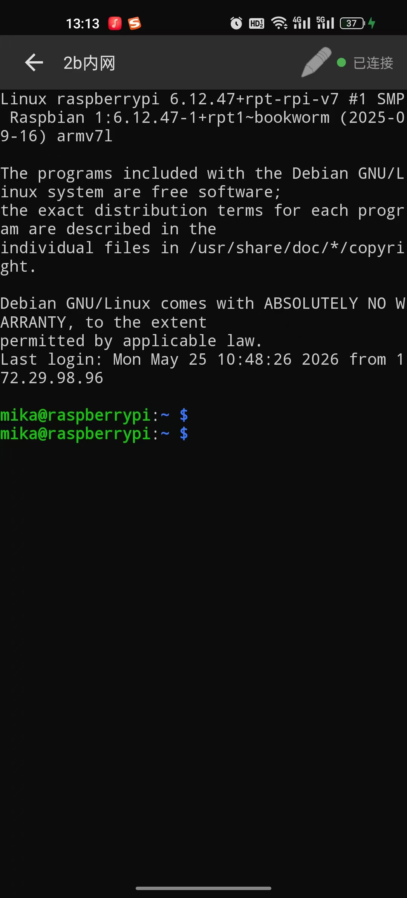
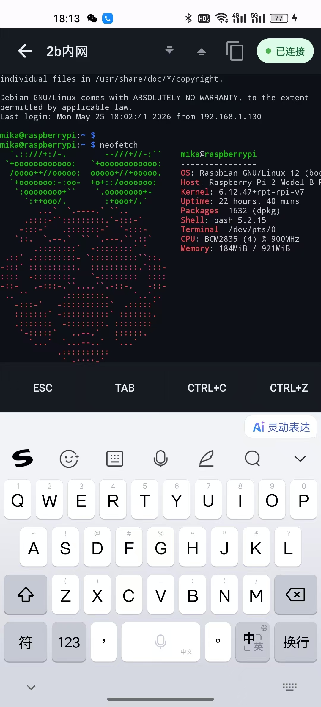

<p align="center">
  
</p>

<h1 align="center">YukiSSH</h1>

<p align="center">
  <strong>超轻量 Android SSH 终端 — 后台常驻、自研终端引擎、100% AI 生成</strong>
</p>

<p align="center">
  <a href="https://github.com/Mrkuzumi/YukiSSH/releases/latest">Latest Release</a>
  <span>&nbsp;|&nbsp;</span>
  <a href="https://github.com/Mrkuzumi/YukiSSH">GitHub 仓库</a>
  <span>&nbsp;|&nbsp;</span>
  <a href="https://github.com/Mrkuzumi/YukiSSH/issues">问题反馈</a>
  <span>&nbsp;|&nbsp;</span>
  <a href="#快速开始">快速开始</a>
  <span>&nbsp;|&nbsp;</span>
  <a href="#免责声明">免责声明</a>
</p>

<p align="center">
  
  
  
  
  
  
</p>

<p align="center">
  
</p>

> [!TIP]
> 遇到连接异常或渲染问题？尝试点击终端工具栏的 **刷新按钮** 重新连接（不清屏）。若键盘弹出时黑屏，请检查是否开启了安全键盘/密码输入模式，YukiSSH 使用透明 EditText 捕获输入，安全键盘可能干扰渲染。切换应用后连接仍存活，下拉通知栏可一键回到终端。

---

## 项目定位

YukiSSH 是一个面向 Android 的极简 SSH 远程终端工具。不是 SSH 库的套壳封装——终端模拟器 `TerminalView` 从零手写，基于 Android Canvas 逐帧渲染，支持 xterm-256color 全彩、ANSI 转义序列、UTF-8/CJK 多字节字符和光标闪烁。

优先级很明确：**连接稳定不在后台断线 > 终端渲染准确 > 输入体验流畅 > 功能扩展**。

> [!IMPORTANT]
> 本项目代码 **100% 由 AI（Claude Opus 4）生成**，不含任何手写代码。从第一行代码到 v2.1 均由 AI 对话式迭代完成。项目处于早期开发阶段，将持续迭代。
>
> 反馈问题请提供 Android 版本、设备型号、复现步骤和截图。不接受恶意利用、未授权访问或绕过安全限制的功能请求。

## 架构概览

YukiSSH 不是 WebView 套壳终端，原生 Canvas 渲染、前台 Service 保活、JSch Shell Channel 分层协作。

| 层 | 主要职责 |
| --- | --- |
| TerminalView (Canvas Renderer) | 字符网格渲染、ANSI 转义解析、UTF-8 解码、光标闪烁、触摸滚动 |
| TerminalActivity | 输入捕获（透明 EditText）、键盘映射、快捷栏、Service 绑定 |
| SSHService (Foreground) | 前台常驻、通知栏状态、WakeLock/WifiLock 保活、电池优化豁免 |
| SSHManager | JSch Shell Channel、SSH 协议级心跳、多监听者回调、PTY 尺寸同步 |
| ConnectionStorage | SharedPreferences JSON 持久化、连接配置 CRUD |

所以 YukiSSH 不是一个套了 Web SSH 前端的 WebView 容器，而是原生 Canvas + JSch 自绘终端引擎。

## 核心能力

<table>
  <tr>
    <td width="33%" valign="top">
      <strong>后台常驻</strong><br />
      前台 Service + 通知栏状态、WakeLock 防休眠、WifiLock 保持网络、电池优化白名单、Android 13+ 通知权限适配。
    </td>
    <td width="33%" valign="top">
      <strong>终端引擎</strong><br />
      自研 TerminalView、xterm-256color、ANSI CSI/SGR、UTF-8/CJK、光标闪烁 500ms、5000 行回滚缓冲、触摸自由滚动。
    </td>
    <td width="33%" valign="top">
      <strong>连接管理</strong><br />
      多组 SSH 配置增删改查、Material Design 3 卡片列表、底栏导航双 Tab、连接状态彩色 Pill 指示器。
    </td>
  </tr>
  <tr>
    <td width="33%" valign="top">
      <strong>输入体验</strong><br />
      21 键横向滚动快捷栏（Esc/Ctrl/方向/符号）、字体 6~20dp 自由缩放、硬件键盘支持、一键复制终端内容。
    </td>
    <td width="33%" valign="top">
      <strong>连接保障</strong><br />
      SSH 协议级心跳（ServerAliveInterval 15s）、断线自动通知、重连保留终端缓冲区、PTY 窗口尺寸同步。
    </td>
    <td width="33%" valign="top">
      <strong>应用更新</strong><br />
      GitHub Releases API 版本检测、APK 下载、System DownloadManager、安装器拉起、Android 8+ 未知来源权限适配。
    </td>
  </tr>
</table>

## 页面速查

| 页面 | 用途 |
| --- | --- |
| 首页 (Home) | 连接列表浏览、点击连接进入终端、长按编辑/删除 |
| 编辑连接 | 新建或修改 SSH 配置（名称、主机、端口、用户、密码） |
| 终端 | SSH 会话交互、快捷栏、字体缩放、复制、重连、状态指示 |
| 关于 | 版本信息、查看源码、关于作者、检查更新 |

## 界面预览

<p align="center">
  
  
  
</p>

## 快速开始

### 获取发布版

普通用户从 [GitHub Releases](https://github.com/Mrkuzumi/YukiSSH/releases/latest) 下载最新 APK。Android 8+ 设备需允许安装未知应用。

首次启动建议先添加一个测试连接，确认终端渲染和输入正常后，再添加生产环境连接。

### 推荐上手路线

| 阶段 | 做什么 |
| --- | --- |
| 1 | 点击 **+** 新建连接，填写主机、端口、用户名、密码 |
| 2 | 点击连接卡片进入终端，确认连接状态灯变绿 |
| 3 | 轻点终端区域唤起键盘，尝试输入命令 |
| 4 | 使用快捷栏的 Esc / 方向键 / Ctrl 等组合键 |
| 5 | 试调字体大小、复制终端内容、测试重连按钮 |

### 构建

```bash
git clone https://github.com/Mrkuzumi/YukiSSH.git
# 用 Android Studio 打开项目根目录，Sync Gradle，Run
```

| 依赖 | 推荐版本 |
| --- | --- |
| Android Studio | Hedgehog 2023.1+ |
| JDK | 17 |
| Android SDK | 34 |
| Gradle | 8.x (wrapper) |

## 技术栈

| 模块 | 选型 |
|------|------|
| 语言 | Kotlin |
| SSH 库 | [JSch (mwiede fork)](https://github.com/mwiede/jsch) |
| 异步 | Kotlin Coroutines + SupervisorJob |
| UI | Jetpack AppCompat + Material Design 3 + RecyclerView + CoordinatorLayout |
| 终端渲染 | 自研 TerminalView，Android Canvas，等宽字体，DP 自适应 |
| 持久化 | SharedPreferences + JSONArray |
| 版本更新 | GitHub Releases API + System DownloadManager |

## 免责声明

### AI 生成声明

本项目代码 **100% 由 AI 生成**（Claude Opus 4），包括但不限于所有 Kotlin 源码、XML 布局、Gradle 构建脚本及本 README。项目处于早期开发阶段，将持续迭代。

### 安全警告

**本应用不适合处理敏感环境或生产服务器。**

- SSH 连接密码以 **明文** 形式存储在 `SharedPreferences` 中，任何拥有 root 权限或能够访问应用私有目录的攻击者均可读取
- 主机密钥校验已 **关闭**（`StrictHostKeyChecking: no`），无法防御中间人攻击（MITM）
- 未实现密钥认证（仅支持密码登录）
- 未实现会话日志脱敏

如果你需要在敏感环境中使用 SSH 客户端，建议使用 [Termux](https://termux.dev/)、[JuiceSSH](https://juicessh.com/) 等经过安全审计的成熟方案。

### 隐私声明

本应用 **不收集、不上传、不分享** 任何用户数据。所有连接配置仅存储在设备本地。但请注意：由于密码为明文存储，建议仅在已加密设备存储的受信任设备上使用。

### 免责条款

本软件按"原样"提供，不提供任何形式的明示或暗示担保。在任何情况下，作者均不对因使用本软件而产生的任何损害承担责任，包括但不限于数据丢失、服务器入侵、系统故障或业务中断。

## 开发计划

- [ ] 密钥认证（SSH Key / Ed25519 / RSA）
- [ ] 密码加密存储（Android Keystore）
- [ ] 主机密钥指纹校验（known_hosts）
- [ ] SFTP 文件管理
- [ ] 终端字体 / 配色主题切换
- [ ] 跳板机（ProxyJump）支持
- [ ] Widget 桌面小组件

## License

MIT License — 详见 [LICENSE](LICENSE)。
